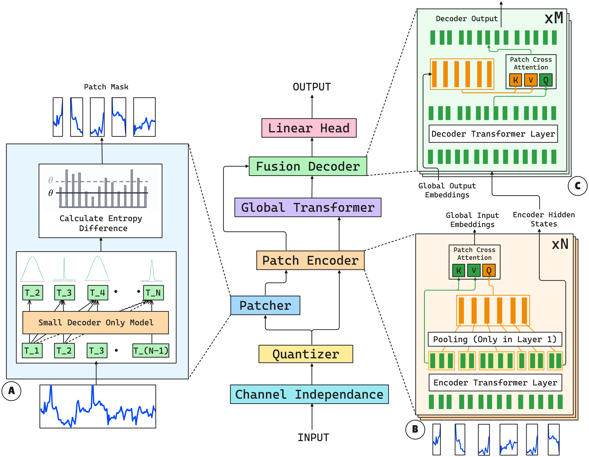

# 🌐 CAPE-TST: Context-Aware Dynamic Patch Encoder for Time Series Transformers

This repository contains the official implementation of the paper:

> **Context-Aware Dynamic Patch Encoder for Time Series Transformers**  
> _Under review at AAAI 2026_  

---

---

## ✨ Overview

**CAPE-TST** introduces a novel framework for dynamic patching and representation learning in time series forecasting using Transformer models. Unlike conventional fixed-length or context-agnostic patching schemes, our method dynamically determines patch boundaries using entropy and encodes each patch using an adaptive encoder.

---

## 🚀 Key Contributions

- ✅ **Entropy-Based Dynamic Patching**  
  Uses information-theoretic entropy to identify meaningful patch boundaries based on temporal uncertainty and fluctuations.

- ✅ **Adaptive Patch Encoder**  
  Applies iterative attention mechanisms to encode variable-length patches into fixed-size latent vectors.

- ✅ **Context-Aware Feature Representation**  
  Preserves both short-term and long-term dependencies by respecting local temporal structures.
 

---

